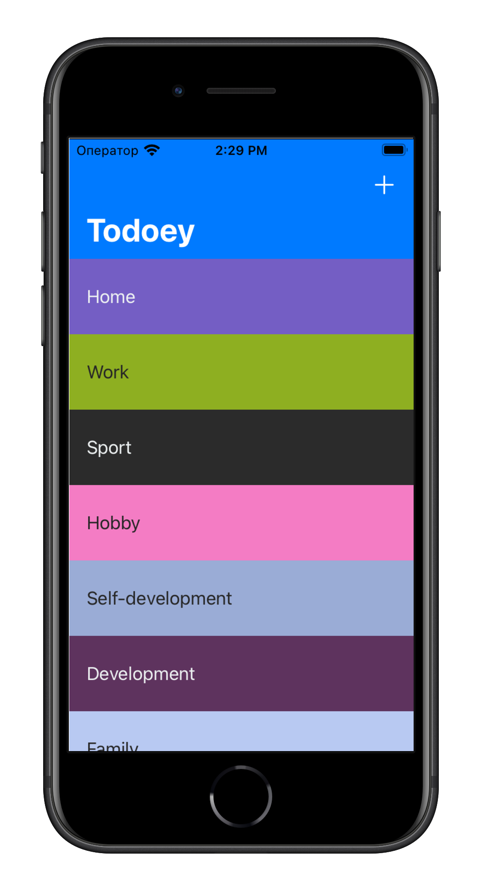

# Todoey ✓

### A to-do list application that allows you to track all tasks.

Data storage was initially implemented in Core Data, then refactoring was carried out, and the data is now stored in Realm.
Implemented a search using the native SearchBar element

